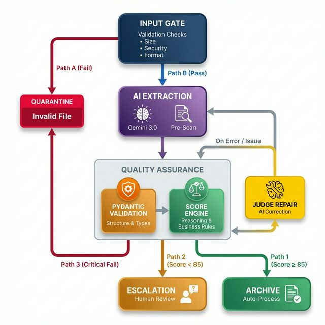

# OCR Pipeline - Technischer Bericht

> **Erstellt am:** 07. Februar 2026  
> **Projekt:** Mistral OCR Demo - Dokumentenverarbeitung für Semiramis

---

## 📋 Inhaltsverzeichnis

1. [Übersicht](#übersicht)
2. [Architektur-Diagramm](#architektur-diagramm)
3. [Pipeline-Schritte im Detail](#pipeline-schritte-im-detail)
4. [Frontend/Backend-Integration](#frontendbackend-integration)
5. [Gesammelte Daten im Prozess](#gesammelte-daten-im-prozess)
6. [Validierungs-Checks](#validierungs-checks)
7. [Score-System](#score-system)

---

## 🎨 Pipeline-Visualisierung



---

## 📖 Übersicht

Die OCR-Pipeline ist ein mehrstufiges System zur automatischen Verarbeitung von Lieferantenbestätigungen (AB's). Sie kombiniert moderne KI-Modelle (Gemini) mit Business-Logik-Validierung und einem Score-basierten Eskalations-System.

### Kernkomponenten

| Komponente | Datei | Zweck |
|------------|-------|-------|
| **UnifiedPipeline** | `core/pipeline/unified_pipeline.py` | Zentrale Pipeline-Klasse |
| **InputGate** | `validation/input_gate.py` | Datei-Validierung vor OCR |
| **GeminiOCR** | `extraction/gemini_ocr_engine.py` | KI-Extraktion mit Structured Output |
| **Judge** | `validation/judge.py` | KI-Reparatur bei Validierungsfehlern |
| **ScoreEngine** | `validation/score.py` | 5-stufige Qualitätsbewertung |
| **TraceService** | `backend/app/services/trace_service.py` | Datenbank-Persistierung |

---

## 🏗️ Architektur-Diagramm

(Siehe oben generiertes Diagramm für die grafische Darstellung)

---

## 🔄 Pipeline-Schritte im Detail

### Step 1: Input Gate (`validation/input_gate.py`)

Die erste Ebene filtert ungültige Dateien **bevor** teure API-Calls gemacht werden. Wenn hier ein Fehler auftritt (z.B. Datei zu groß, verschlüsselt), geht die Datei direkt in die **Quarantäne**.

```
┌──────────────────────────────────────────────────────────────┐
│                      INPUT GATE CHECKS                        │
├──────────────────────────────────────────────────────────────┤
│                                                               │
│  📋 1. HEALTH CHECK                                           │
│  ├─ Magic Bytes prüfen (PDF: %PDF, JPG: FFD8FF, PNG: 89PNG)  │
│  ├─ Datei-Größe > 100 Bytes?                                 │
│  └─ PDF verschlüsselt? → Ablehnung                           │
│                                                               │
│  📄 2. PDF PROCESSING (nur mit PyMuPDF)                       │
│  ├─ PDF-Typ erkennen (digital_born / scanned / mixed)        │
│  ├─ Leere Seiten entfernen                                   │
│  └─ Seitenzahl ermitteln                                     │
│                                                               │
│  ⚠️ 4. QUARANTINE (bei Ablehnung)                             │
│  ├─ Datei in 98_Error_Quarantine speichern                   │
│  └─ Log-Datei mit Fehlergrund erstellen                      │
│                                                               │
└──────────────────────────────────────────────────────────────┘
```

**Gesammelte Daten:**
- `is_valid`: bool
- `processed_bytes`: Bereinigte PDF (ohne leere Seiten)
- `pdf_type`: "digital_born" / "scanned" / "mixed"
- `page_count`: int
- `file_size_mb`: float

---

### Step 2: OCR mit Gemini (`extraction/gemini_ocr_engine.py`)

Nutzt **Gemini 3.0 Flash** mit **Structured Output** für direkte JSON-Extraktion.

**Pre-Scan Optimierung (Hybrid Logic):**
- Vor der OCR wird ein schneller BA-Nummer-Scan durchgeführt
- Falls bekannter Lieferant → Template-Koordinaten als Hints übergeben

---

### Step 3 & 4: Qualitätssicherung (Pydantic & Scoring)

Die Qualitätssicherung funktioniert als zentrale Einheit mit **zwei Eskalationsstufen**.

#### Ablauf:

1. **Pydantic Validierung** (Struktur prüfen)
   - Sind alle Pflichtfelder da?
   - Stimmen die Datentypen?
   - Ist das JSON valide?
   - **Bei Fehler:** → **Judge Schema Repair** (Stufe 1)

2. **Score Engine** (Qualität bewerten, 0-100 Punkte)
   - Wurde ein Reasoning geliefert? (-5 Punkte wenn nein)
   - Stimmen die mathematischen Berechnungen? (Menge * Preis)
   - Ist der Lieferant bekannt? (+Bonus)
   - Datums-Plausibilität, Summen-Validierung
   - **Bei Score < 85:** → **Judge Business Repair** (Stufe 2) ← **NEU!**

#### Judge Stufe 1: Schema Repair
Wenn Pydantic einen **strukturellen** Fehler meldet:
- Beispiel: "Feld 'Datum' ist kein valides Datumsformat"
- Der Judge analysiert das Original-Dokument und die Fehlermeldung
- Er versucht, das JSON zu "heilen"
- Wenn erfolgreich → Weiter zum Scoring

#### Judge Stufe 2: Business Repair (**NEU!**)
Wenn der Score < 85 ist (z.B. 72 Punkte):
- Der Judge erhält die **Liste der Punktabzüge** (z.B. "Rechenfehler Zeile 1")
- Er analysiert erneut das Original-Dokument
- Er versucht, **inhaltliche** Fehler zu korrigieren
- Erneutes Scoring nach Reparatur
- **Wenn Score verbessert** (z.B. 72 → 88): Archiv ✅
- **Wenn Score immer noch < 85**: Eskalation zum Menschen ⚠️

**Beispiel-Szenarien:**

| Problem | Score Penalty | Judge Aktion | Ergebnis |
|---------|---------------|--------------|----------|
| OCR las "3" als "8" | -10 (Rechenfehler) | Korrigiert Ziffer basierend auf Kontext | Score steigt |
| Datum "2029" statt "2025" | -15 (Datum unplausibel) | Erkennt Tippfehler, korrigiert Jahr | Score steigt |
| Keine BA-Nummer gefunden | -25 (Pflichtfeld fehlt) | Findet BA-Nummer an anderer Stelle | Score steigt |
| Summen stimmen nicht | -20 (Sum validation failed) | Rechnet nach, korrigiert Footer | Score steigt |

**Tracking in Datenbank:**
- `schema_repair_attempted`: War Stufe 1 nötig?
- `business_repair_attempted`: War Stufe 2 nötig?
- `business_repair_success`: Hat Stufe 2 Score verbessert?
- `initial_score`: Score VOR Business Repair (z.B. 72)
- `final_score`: Score NACH Business Repair (z.B. 88)
- `score_improvement`: Verbesserung (z.B. +16)

---

### Step 5: Entscheidungs-Logik (Output)

Die finale Entscheidung, wohin ein Dokument geht, basiert auf dem Score und dem Validierungs-Status.

1. **ARCHIV (Score ≥ 85)**
   - Dokument ist valide und hat eine hohe Qualität.
   - Wird automatisch exportiert/archiviert.

2. **ESKALATION (Score < 85)**
   - Dokument ist technisch valide, aber die Qualität/Sicherheit ist zu niedrig.
   - Geht in die **Frontend Queue** zur manuellen Prüfung durch einen Menschen.

3. **QUARANTÄNE (Critical Fail)**
   - Dokument konnte nicht validiert werden (auch nach Judge-Einsatz).
   - Oder Input-Gate hat Fehler gemeldet.
   - Geht in den Fehler-Ordner.

```
┌──────────────────────────────────────────────────────────────┐
│                    SCORE ENGINE                               │
│                   (5 Prüfungs-Stufen)                         │
├──────────────────────────────────────────────────────────────┤
│                                                               │
│  📊 1. REASONING CHECK (-5 Punkte)                            │
│  └─ Hat die KI ihre Entscheidungen begründet?                │
│                                                               │
│  📋 2. PFLICHTFELDER CHECK (-20 bis -50 Punkte)               │
│  ├─ Datum fehlt: -20 Punkte                                  │
│  ├─ BA-Nummer fehlt: -25 Punkte                              │
│  └─ Keine Positionen: -50 Punkte                             │
│                                                               │
│  🚦 3. STATUS FLAGS CHECK (bis -100 Punkte)                   │
│  ├─ Falscher Dokumenttyp: -100 (Showstopper!)                │
│  ├─ Datums-Plausibilität                                     │
│  └─ Summen-Validierung                                       │
│                                                               │
│  🧮 4. ZEILEN-MATHEMATIK CHECK (max -30 Punkte)               │
│  ├─ Menge × Preis = Gesamtpreis?                             │
│  └─ 10 + (Fehleranzahl × 2) Punkte Abzug                     │
│                                                               │
│  🏢 5. ERP/BUSINESS CHECK (-15 bis +15 Punkte)                │
│  ├─ Bekannter Lieferant: +10 Bonus                           │
│  ├─ Template vorhanden: +15 Bonus                            │
│  └─ Unbekannter Lieferant: -15 Punkte                        │
│                                                               │
├──────────────────────────────────────────────────────────────┤
│                                                               │
│  📈 SCORE-SCHWELLENWERTE                                      │
│  ├─ ≥ 85 Punkte → Automatisch archiviert                     │
│  ├─ 70-84 Punkte → OCR_DONE (Review empfohlen)               │
│  └─ < 70 Punkte → NEEDS_REVIEW (Eskalation)                  │
│                                                               │
└──────────────────────────────────────────────────────────────┘
```

---

## 🔌 Frontend/Backend-Integration

```
┌────────────────────────────────────────────────────────────────────────────┐
│                      SYSTEM-ARCHITEKTUR                                     │
├────────────────────────────────────────────────────────────────────────────┤
│                                                                             │
│  ┌───────────────┐                        ┌───────────────┐                │
│  │  BATCH RUNNER │                        │   FRONTEND    │                │
│  │  (Python)     │                        │   (Next.js)   │                │
│  └───────┬───────┘                        └───────┬───────┘                │
│          │                                        │                         │
│          │ 1. Verarbeitet PDFs                    │ 4. Zeigt Queue an       │
│          │ 2. Ruft UnifiedPipeline                │ 5. Manuelle Korrektur   │
│          │ 3. Speichert via TraceService          │                         │
│          │                                        │                         │
│          ▼                                        ▼                         │
│  ┌───────────────────────────────────────────────────────────┐             │
│  │                    BACKEND (FastAPI)                       │             │
│  │                    Port: 8000                              │             │
│  ├───────────────────────────────────────────────────────────┤             │
│  │                                                            │             │
│  │  📂 ROUTERS                                                │             │
│  │  ├── upload.py       → POST /documents/upload             │             │
│  │  ├── queue.py        → GET  /documents/queue              │             │
│  │  ├── claiming.py     → POST /documents/{id}/claim         │             │
│  │  ├── processing.py   → POST /documents/{id}/process       │             │
│  │  └── annotations.py  → CRUD für Annotationen              │             │
│  │                                                            │             │
│  │  🔧 SERVICES (Business Logic)                              │             │
│  │  ├── pipeline.py     → PipelineService Wrapper            │             │
│  │  ├── trace_service.py→ Datenbank-Persistierung            │             │
│  │  ├── coordinates.py  → Gemini→PDF Koordinaten             │             │
│  │  └── storage.py      → Datei-Management                   │             │
│  │                                                            │             │
│  └────────────────────────┬──────────────────────────────────┘             │
│                           │                                                 │
│                           ▼                                                 │
│  ┌────────────────────────────────────────────────────────────────────┐    │
│  │                         SQLite DATENBANK                            │    │
│  │                         (demo.db)                                   │    │
│  ├────────────────────────────────────────────────────────────────────┤    │
│  │                                                                     │    │
│  │  📊 FRONTEND TABLES              📈 TRACE TABLES                    │    │
│  │  ├── document                   ├── processing_run                 │    │
│  │  ├── document_files             ├── extracted_document             │    │
│  │  ├── annotations                ├── score_penalty                  │    │
│  │  ├── valid_ba_numbers           └── score_signal                   │    │
│  │  └── supplier_templates                                            │    │
│  │                                                                     │    │
│  └────────────────────────────────────────────────────────────────────┘    │
│                                                                             │
└────────────────────────────────────────────────────────────────────────────┘
```

### API-Endpunkte

| Methode | Pfad | Beschreibung |
|---------|------|--------------|
| `POST` | `/documents/upload` | PDF hochladen |
| `GET` | `/documents/queue` | Warteschlange abrufen |
| `GET` | `/documents/{id}` | Dokument-Details |
| `POST` | `/documents/{id}/claim` | Dokument für Bearbeitung sperren |
| `DELETE` | `/documents/{id}/claim` | Sperre aufheben |
| `POST` | `/documents/{id}/process` | OCR-Pipeline ausführen |
| `GET` | `/documents/{id}/annotations` | Annotations abrufen |
| `POST` | `/documents/{id}/annotations` | Annotation speichern |

---

## 📊 Gesammelte Daten im Prozess

### 1. ProcessingRun (pro PDF-Verarbeitung)

| Feld | Typ | Beschreibung |
|------|-----|--------------|
| `id` | UUID | Primärschlüssel |
| `filename` | string | Original-Dateiname |
| `file_size_bytes` | int | Dateigröße |
| `page_count` | int | Seitenzahl |
| `is_scanned` | bool | Gescanntes Dokument? |
| `started_at` | datetime | Startzeitpunkt |
| `finished_at` | datetime | Endzeitpunkt |
| `duration_ms` | int | Verarbeitungsdauer |
| `success` | bool | Erfolg? |
| `error_message` | string | Fehlertext (falls Fehler) |
| `final_status` | enum | ARCHIVED / QUARANTINE / ESCALATED |
| `pipeline_mode` | string | "Direct JSON" / "Classic" |
| `ocr_model` | string | z.B. "gemini-3-flash-preview" |
| `llm_model` | string | z.B. "gemini-3-pro" (Judge) |
| `raw_markdown` | text | Rohtext (optional) |
| `raw_json` | text | Extrahiertes JSON |
| `reasoning_text` | text | KI-Reasoning |

### 2. ExtractedDocument (pro BA-Nummer im PDF)

| Feld | Typ | Beschreibung |
|------|-----|--------------|
| `run_id` | UUID | FK zu ProcessingRun |
| `document_index` | int | Position im PDF |
| `ba_number` | string | Bestellnummer |
| `vendor_number` | string | Lieferanten-Nr. |
| `vendor_name` | string | Lieferantenname |
| `document_date` | date | Belegdatum |
| `document_type` | string | AB / Rechnung / etc. |
| `net_total` | float | Nettosumme |
| `position_count` | int | Anzahl Positionen |
| `score` | int | Qualitäts-Score (0-100) |
| `needs_review` | bool | Manuelle Prüfung nötig? |
| `has_template` | bool | Template vorhanden? |
| `xml_output` | text | Generiertes XML |
| `frontend_document_id` | UUID | FK zu Frontend-Queue |

### 3. ScorePenalty (Punktabzüge)

| Feld | Typ | Beschreibung |
|------|-----|--------------|
| `document_id` | UUID | FK zu ExtractedDocument |
| `points` | int | Abgezogene Punkte |
| `reason` | string | Begründung |
| `category` | enum | MISSING_FIELD / WRONG_TYPE / MATH_ERROR / etc. |

### 4. ScoreSignal (Positive Signale)

| Feld | Typ | Beschreibung |
|------|-----|--------------|
| `document_id` | UUID | FK zu ExtractedDocument |
| `signal` | string | Info-Text |
| `is_bonus` | bool | Bonuspunkte? |
| `bonus_points` | int | Anzahl Bonus-Punkte |

---

## ✅ Validierungs-Checks (Zusammenfassung)

```
┌─────────────────────────────────────────────────────────────────────────────┐
│                           ALLE VALIDIERUNGS-CHECKS                           │
├─────────────────────────────────────────────────────────────────────────────┤
│                                                                              │
│  🔒 INPUT GATE (vor OCR)                                                     │
│  ├── Magic Bytes (Datei-Signatur)                                           │
│  ├── Mindestgröße (> 100 Bytes)                                             │
│  ├── Verschlüsselung (PDF nicht passwortgeschützt)                          │
│  ├── Max. Dateigröße (50 MB für Gemini)                                     │
│  ├── Max. Seitenzahl (1000 Seiten)                                          │
│  └── Leere Seiten entfernen                                                 │
│                                                                              │
│  📝 PYDANTIC SCHEMA (nach OCR)                                               │
│  ├── Typ-Validierung aller Felder                                           │
│  ├── Pflichtfelder vorhanden?                                               │
│  ├── Dokumenttyp-Check (AB / Rechnung / Lieferschein)                       │
│  ├── Datums-Plausibilität (nicht in ferner Zukunft/Vergangenheit)           │
│  ├── Summen-Validierung (Footer = Σ Positionen)                             │
│  └── Zeilen-Mathematik (Menge × Preis = Gesamtpreis)                        │
│                                                                              │
│  🎯 SCORE ENGINE (Qualitätsbewertung)                                        │
│  ├── Reasoning vorhanden (-5 bei Fehlen)                                    │
│  ├── BA-Nummer vorhanden (-25 bei Fehlen)                                   │
│  ├── Datum vorhanden (-20 bei Fehlen)                                       │
│  ├── Positionen vorhanden (-50 bei Fehlen)                                  │
│  ├── Korrekter Dokumenttyp (-100 bei falsch!)                               │
│  ├── Datums-Warnungen (-10 bis -15)                                         │
│  ├── Summen-Diskrepanz (-5 bis -20)                                         │
│  ├── Rechenfehler (dynamisch, max -30)                                      │
│  ├── Bekannter Lieferant (+10 Bonus)                                        │
│  └── Template vorhanden (+15 Bonus)                                         │
│                                                                              │
│  🔧 JUDGE (bei Validierungsfehlern)                                          │
│  ├── Re-Analyse mit Original-PDF                                            │
│  ├── Fehler-Liste als Input                                                 │
│  ├── Template-Koordinaten (falls verfügbar)                                 │
│  └── Structured Output erzwingen                                            │
│                                                                              │
└─────────────────────────────────────────────────────────────────────────────┘
```

---

## 📁 Trace-Ordner Struktur

Bei jedem verarbeiteten Dokument werden auch Dateien im `03_Process_Trace` Ordner gespeichert:

```
03_Process_Trace/
└── <filename>/
    ├── 1_raw_markdown.md       # OCR-Rohtext (falls vorhanden)
    ├── 2_extracted_data.json   # Extrahiertes JSON
    ├── reasoning_<model>.txt   # KI-Reasoning pro Dokument
    ├── 3_final.xml             # Generiertes XML
    ├── 4_score_card.json       # Score-Details
    └── process_log.txt         # Verarbeitungs-Log
```

---

## 🔄 Datenfluss-Diagramm

```
     ┌────────────┐
     │   PDF      │
     │  Upload    │
     └─────┬──────┘
           │
           ▼
    ┌──────────────┐     ┌─────────────────┐
    │  INPUT GATE  │────▶│  📦 Quarantäne   │
    │  Validierung │     │  (bei Fehler)   │
    └──────┬───────┘     └─────────────────┘
           │ ✓
           ▼
    ┌──────────────┐
    │  PRE-SCAN    │◀────┐
    │  BA-Nummer   │     │ Template-
    └──────┬───────┘     │ Koordinaten
           │             │
           ▼             │
    ┌──────────────┐     │
    │   GEMINI     │────▶├─────────────────┐
    │   OCR/LLM    │     │                 │
    └──────┬───────┘     │  📊 Datenbank   │
           │             │                 │
           ▼             │  ProcessingRun  │
    ┌──────────────┐     │  ExtractedDoc   │
    │   PYDANTIC   │     │  ScorePenalty   │
    │  Validierung │     │  ScoreSignal    │
    └──────┬───────┘     │                 │
           │             └─────────────────┘
      ┌────┴────┐
      │ Fehler? │
      └────┬────┘
    ✓ │    │ ✗
      │    ▼
      │ ┌──────────┐
      │ │  JUDGE   │
      │ │ Reparatur│
      │ └────┬─────┘
      │      │
      ▼      ▼
    ┌──────────────┐
    │    SCORE     │
    │   ENGINE     │
    └──────┬───────┘
           │
    ┌──────┴──────────────────┐
    │                         │
    ▼                         ▼
┌─────────┐           ┌─────────────┐
│ ≥ 85    │           │   < 85      │
│ ARCHIV  │           │ ESKALATION  │
└─────────┘           └──────┬──────┘
                             │
                             ▼
                      ┌─────────────┐
                      │  Frontend   │
                      │   Queue     │
                      │  (Next.js)  │
                      └─────────────┘
```

---

## 📌 Fazit

Die OCR-Pipeline ist ein robustes, mehrstufiges System das:

1. **Kosten spart** durch Input-Validierung vor teuren API-Calls
2. **Qualität sichert** durch 5-stufiges Scoring mit konfigurierbaren Schwellenwerten
3. **Self-Healing** ermöglicht durch den Judge (KI-Reparatur)
4. **Hybrid-Logik** nutzt mit Template-Koordinaten für bekannte Lieferanten
5. **Vollständig traceable** ist durch DB-Persistierung aller Metriken
6. **Human-in-the-Loop** unterstützt durch Frontend-Integration bei niedrigen Scores

Die Integration zwischen Batch-Runner (automatisiert) und Backend/Frontend (manuell) ermöglicht flexible Workflows - von vollautomatischer Verarbeitung bis zur menschlichen Prüfung bei kritischen Fällen.
